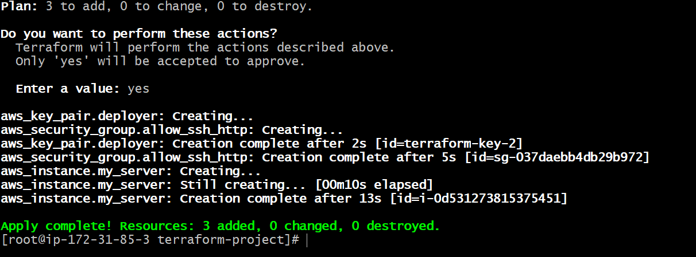

# 🚀 AWS DevOps Automation Project

## 📌 Project Overview
This project demonstrates complete DevOps automation using:

- Terraform (Infrastructure as Code)
- Ansible (Configuration Management)
- AWS EC2 (Cloud Infrastructure)
- CloudWatch (Monitoring & Alerts)

---

## 🛠️ Technologies Used
- AWS EC2
- Terraform
- Ansible
- Nginx
- CloudWatch
- SNS (Email Alerts)

---

## ⚙️ What This Project Does

✔ Creates EC2 instance using Terraform  
✔ Configures server using Ansible  
✔ Installs and runs Nginx web server  
✔ Deploys a simple web page  
✔ Monitors CPU usage using CloudWatch  
✔ Sends email alert when CPU > 80%  
✔ Demonstrates backup/restore concept  

---

## 📂 Project Structure

---

## 🚀 Steps Performed

### 1. Infrastructure Setup (Terraform)
- Created EC2 instance
- Configured Security Group
- Added SSH Key Pair

---

### 2. Configuration Management (Ansible)
- Connected to EC2
- Installed Nginx
- Started and enabled service
- Created web page

---

### 3. Monitoring (CloudWatch)
- Created CPU utilization alarm
- Threshold set to 80%
- SNS email notification configured

---

### 4. Testing Alert
- Generated CPU load using:
- - Alarm triggered successfully
- Email notification received

---

### 5. Backup & Restore
- Created backup instance
- Verified website working on new instance

---

## 📸 Screenshots

### Terraform Apply

---

## 🎯 Outcome

This project demonstrates real-world DevOps workflow including:
- Infrastructure automation
- Server configuration
- Monitoring and alerting
- High availability concepts

---

## 👨‍💻 Author
Abhishek
