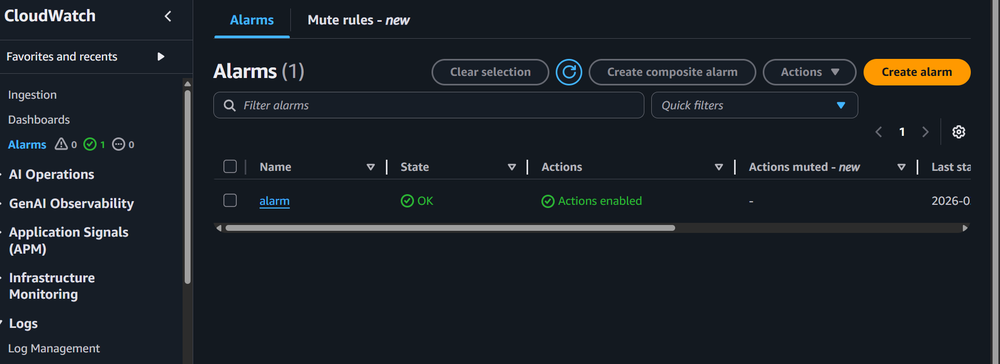

# 🚀 AWS DevOps Automation Project

## 📌 Project Overview
This project demonstrates an end-to-end DevOps workflow using infrastructure automation, configuration management, monitoring, and backup on AWS.

---

## 🛠️ Technologies Used
- AWS EC2
- Terraform
- Ansible
- Nginx
- CloudWatch
- SNS (Email Alerts)

---

## ⚙️ Key Features

- Automated EC2 provisioning using Terraform  
- Configured web server using Ansible  
- Deployed Nginx with custom webpage  
- Implemented monitoring using CloudWatch  
- Configured SNS for alert notifications  
- Performed backup and restore using AMI  

---

## 📂 Project Structure
---
## 🚀 Steps Performed

### 1. Infrastructure Setup (Terraform)
- Created EC2 instance  
- Configured Security Group  
- Added SSH Key Pair  

📸  

### 🚀 EC2 Instance Before Terraform Apply

### 🚀 EC2 Instance After (Second View)

---

### 2. Configuration Management (Ansible)
- Installed Nginx  
- Started and enabled service  
- Created web page  

📸  

---

### 3. Website Output

📸  

---

### 4. Monitoring (CloudWatch)
- Created CPU alarm (threshold: 80%)  

📸  

---

### 5. Alert Testing
Generated CPU load using:
Alarm triggered 
Email received

### 6. Backup & Restore
Created AMI backup
Launched new instance
Verified application

---

## 🎯 Outcome

This project demonstrates real-world DevOps workflow including:
- Infrastructure automation
- Server configuration
- Monitoring and alerting
- High availability concepts

---

## 👨‍💻 Author
Abhishek
